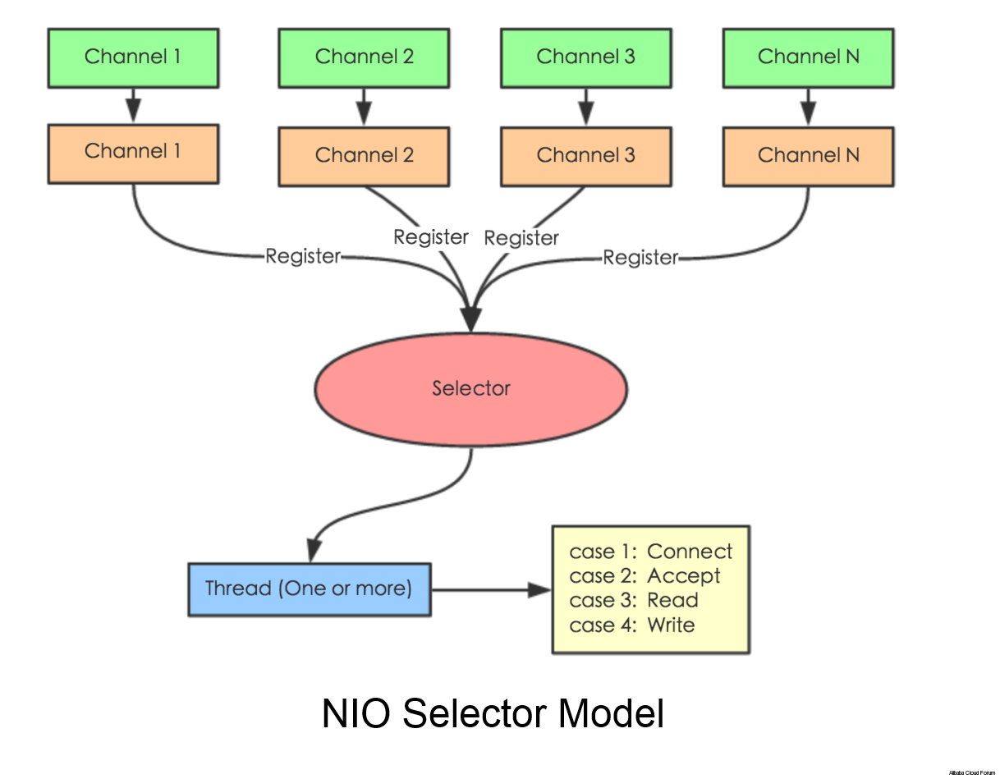

IO (input/output) 通常指数据在内部存储器和外部存储器或其他周边设备之间的输入和输出。 NIO 是 Non-blocking IO 的缩写，即非阻塞式 IO，是一种计算机处理输入和输出的一种方式。

原始 IO 处理方式是，当数据可读之前会一直等待并占用线程资源却不做任何事情，因此当需要处理多个 chanle时就需要启用多个线程；而 NIO 可以只用一个线程来处理多个 chanle ,因为 NIO当数据可读之前不会一直傻等，而是每隔一段时间就检查，那么对于多个 chanle 来说，他们中有一个是可读状态才使用 cpu执行；

  
**JJava IO: A classic IO server design - one connection handled by one thread.**

  
**Java NIO: A single thread managing multiple connections**

  

--
参考：

[https://tech.meituan.com/2016/11/04/nio.html](https://tech.meituan.com/2016/11/04/nio.html)  
[https://segmentfault.com/a/1190000017040893](https://segmentfault.com/a/1190000017040893)  
[http://tutorials.jenkov.com/java-nio/nio-vs-io.html](http://tutorials.jenkov.com/java-nio/nio-vs-io.html)