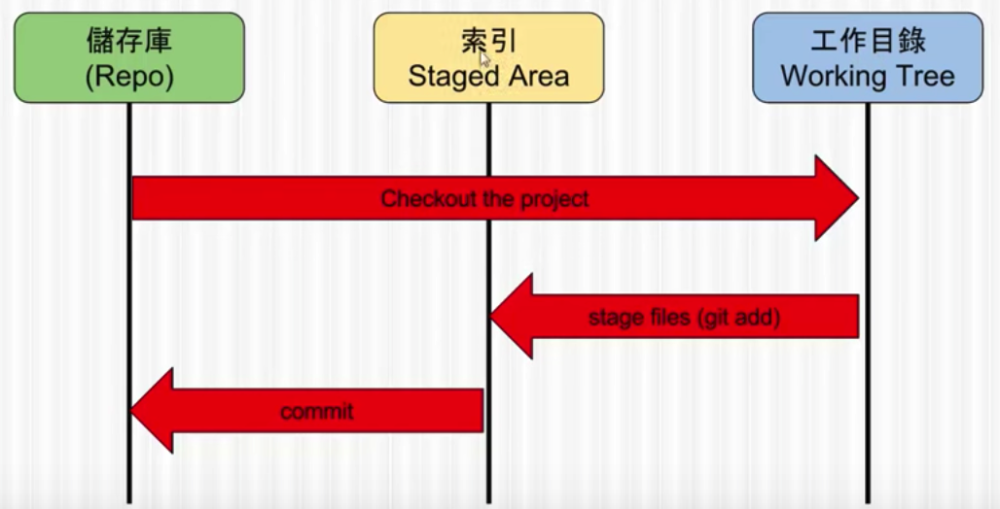

git是日常工作常用的开发工具，本篇文章将粗略讲解关于git的两部分内容，一是git中的基本概念这将有助于了解git命令的具体含义，二是日常工作中常用到的一些git命令和git的开发流程。

## Git中的基础概念

git中比较重要的两个概念是空间和版本（commit），git中的命令都是对这两个概念的操作。了解了这两个概念，就可以感知到git中可以支持哪些操作，即使有些命令我们没有学过，也可以通过到搜索了解到。

### 第一个概念：空间

git中有三种空间

- 工作区（Word Space）
- 储存库（Repo）
- 暂存区（Staged Area，Index）


工作区就是git所在目录，就是文件系统中的一个普通目录。

暂存区指.git目录下的index文件，通过git add命令可以将工作区目录下的文件添加到暂存区中。同时它也有索引作用，它对应到储存库中的文件（索引理解的还不是很透彻可能有错误）。

储存库指工作区下的.git目录（应该是里面的某个目录），里面记录了各个版本的所有内容，只有commit的内容才是真正会保存到储存库中。




### 第二个概念：版本（commit）

我理解的版本就是每一次commit的内容。各个版本之间是一种增量并且依赖的关系，新的版本会依赖旧的版本。每一个版本都有一个key来唯一标识这个commit。

通过commit可以引出分支的概念，每个分支其实是其实就是指向了一个commit，HEAD指向的就是当前的commit。


## Git日常开发

git命令比较多，但日常开发中实际用到的比较小，下面会通过一些实际场景介绍一些常用的git命令。


### git配置

```
$ git config --global user.name "John Doe"
$ git config --global user.email johndoe@example.com
```

git提交时会注明提交人的姓名和邮箱，当多个协同工作时以标名操作人。


### git初始化

git的初始化分为两种场景，一是git库已经有了，要在这个git库基本上进行开发；另外一种是，我们先在本地进行的开发，然后想上传到服务器上。

第一种的话可以使用git clone命令：

```
$ git clone git://github.com/schacon/grit.git
```

第二种话，要先添加远程git然后将自己的代码提交上去。

```
$ git remote add origin git@github.xxx.cn:xxx/xxx.git
$ git push -u origin master
```


### 程序开发

git有不同的工作的流（gitflow），但共同的特点是，对于先功能的开发，要先新建分支开发完成后再merge回master分支。

```
$ git branch <branch name>
$ git checkout <branch name>
...开发
$ git checkout master
$ git merge <branch name>
```


## 其它

git的分支是一种指标，指向commit

head也是一种指标，指向当前工作区的分支

对于一个已跟踪的文件，当对该文件进行修改后，该文件的状态为modify，使用git add 可以将这次的modify内容添加到暂存区，如果再对该文件进行修改，并进行git commit，那么commit的只是git add时刻的内容，最新修改的内容将不会提交，这也是git add命令和暂存区的意义所在。

`git diff` 不过是显示还没有暂存起来的改动，而不是这次工作和上次提交之间的差异。

git rm 可以不再跟踪文件，但存储库依然

每一个commit都是一个Key，代表了存储库中的一个版本，


更多好细节和命令可心参考[git book](https://git-scm.com/book/zh/v1/%E8%B5%B7%E6%AD%A5)