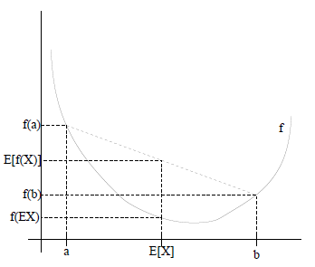
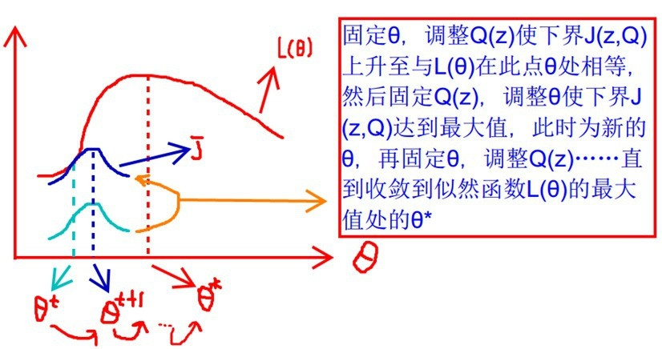

EM算法和最大似然估计一样是一种参数估计方法，与最大似然估计不同的是EM算法可以对着包含隐变量的数据进行参数估计。**EM算法的思想是：若参数$\Theta$已知，则可根据训练数据推断出隐变量Z的值（E步）；反之，若Z的值已知，则可方便地对参数$\Theta$做极大似然估计（M步）。**

##  Jensen不等式
令f(x)是一个凸函数(e.g f''(x)>=0,二阶导数大于0)，令x为随机变量。
那么，
$$
f(E[x])<=E[f(x)]
$$
用一句话表达Jensen不等式，当函数是凸函数，那么该函数的期望大于等于期望的函数值。当X=E(X),当X为常量概率为1，E[f(x)] = f(E[x])。

如图，有0.5的概率是a，有0.5的概率是b。（就像掷硬币一样）。X的期望值就是a和b的中值了。

同理，对于凹函数，f''<=0,$f(E[x])>=E[f(x)]$。

##EM算法
假定有训练数据集
$$
\{ x^{(1)} , x^{(2)} , x^{(3)} \dots x^{(m)} \}
$$
样本相互独立，我们想找到每个样例隐含的类别z。
模型$P(x,z;\theta)$,只能观测到x，对数似然函数，
$$
\begin{align}
l(\theta) 
&= \sum^m_{i=1}\log P(x^i;\theta) \\
&= \sum^m_{i=1}\log \sum_{z^i} P(x^i,z^i;\theta)
\end{align}
$$
然后我们求极大似然
$$
\begin{align}
\sum^m_{i=1}\log \sum_{z^i} P(x^i,z^i;\theta) & = \sum_i\log\sum_{z^{(i)}}P(x^{(i)},z^{(i)};\theta)  \\
& = \sum_i \log \sum_{z^{(i)}} Q(z^{(i)})  \frac{P(x^{(i)},z^{(i)};\theta)}{Q(z^{(i)})}  \\
& \ge \sum_i \sum_{z^{(i)}} Q(z^{(i)}) \log  \frac{P(x^{(i)},z^{(i)};\theta)}{Q(z^{(i)})}
\end{align}
$$
最后一步用到了Jensen不等式，f(x)的f对应log函数，x对应$ \frac{P(x^{(i)},z^{(i)};\theta)}{Q(z^{(i)})}$，p(x)对应$Q(z^{(i)})$。那么$f(E[x])$对应$\log \sum_{z^{(i)}} Q(z^{(i)})  \frac{P(x^{(i)},z^{(i)};\theta)}{Q(z^{(i)})}$，$E[f(x)]$对应$\sum_{z^{(i)}} Q(z^{(i)}) \log  \frac{P(x^{(i)},z^{(i)};\theta)}{Q(z^{(i)})}$。
因此$Q(z^{(i)})$代表的是p(x)也就是概率，所以显然
$$
\sum_{z^{(i)}} Q(z^{(i)}) = 1 ,  Q(z^{(i)})>0
$$

log函数为凸函数
$$
l(\theta)>=\sum_i\sum_{z^{(i)}}Q_i(z^{(i)}) \log\frac{P(x^{(i)},z^{(i)};\theta)}{Q(z^{(i)})}
$$
为对数似然函数的下界，现在想让
$$
l(\theta)=\sum_i\sum_{z^{(i)}}Q_i(z^{(i)}) \log\frac{P(x^{(i)},z^{(i)};\theta)}{Q(z^{(i)})}
$$
根据jesen不等式，也就是想让
$$
\log\frac{P(x^{(i)},z^{(i)};\theta)}{Q(z^{(i)})}=constant
$$
也就是说不管$z^{(i)}$为什么值，值函数的值相同。

当然，同时也要保证
$$
\sum_{z^{(i)}}Q_i(z^{(i)})=1
$$

为了满足上述条件，经过相关推导，
$$
\begin{align}
Q_i(z^{(i)}) & = \frac{P(x^{(i)},z^{(i)};\theta)}{\sum_{z^{(i)}}P(x^{(i)},z^{(i)};\theta)} \\\\
& =  \frac{P(x^{(i)},z^{(i)};\theta)}{P(x^{(i)};\theta)}  \\\\
& =  P( z^{(i)} | x^{(i)};\theta)
\end{align}
$$

---

上面推导的结果其实就是EM算法的E步，所以
E步为：
对于每一个i计算
$$
set \ Q_i(z^{(i)}) = P( z^{(i)} | x^{(i)};\theta)
$$
注意这里的Q函数是用前一次的参数计算出来的值 。

M步为
$$
\theta:=\mathop{argmax}_{\theta} \sum_i\sum_{z^{(i)}}Q_i(z^{(i)}) \log\frac{P(x^{(i)},z^{(i)};\theta)}{Q(z^{(i)})}
$$
这里的$P(x^{(i)},z^{(i)})$是指分布。
在迭代的过程中$Q_i(z^{(i)})$一直在改变，$\theta$也一直在改变。整个EM的过程可以通过如下图理解。

- - - - -
参考：
http://www.cnblogs.com/jerrylead/archive/2011/04/06/2006936.html