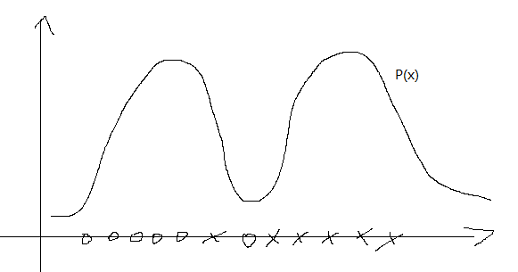

## 混合高斯模型
假设z为隐变量，x,z存在如下关系。
$$
P(x^{(i)},z^{(i)}) = P(x^{(i)}|z^{(i)})P(z^{(i)})
$$
$$
z^{(i)} \sim Multinomial(\phi)$ \\
\phi_j=P(z^{(i)}=j)>0 \\
\sum_j\phi_j=1 \\
(x^{(i)} \mid {z^{(i)}=j} ) \sim N(\mu_j ,\Sigma_j)
$$
这里的j的聚类的一个类别之一。

E-step:
对z的猜测
$$
\begin{aligned}
w_j^{(i)} & := P(z^{(i)}_j \mid x^{(i)}=j;\phi,\mu_j,\Sigma_j) \\
&= \frac{ P(x^{(i)} \mid z^{(i)}_j=j)P(z^{(i)}_j=j)}{\sum_l^n P(x^{(i)} \mid z^{(i)}_j=l)P(z^{(i)}_j=l)}
\end{aligned}
$$

其中，$P(z^{(i)}_j \mid x^{(i)}=j;\phi,\mu_j,\Sigma_j)$表示第i个样本生成z为类别j的概率。这里的n表示聚类总类别数。

M-step:
对参数的估计
$$
\phi_j:=\frac{1}{m} \sum_{i=1}^m w_j^{(i)} \\
\mu_j:= \frac{\sum_{i=1}^m w_j^{(i)} x^{(i)} }{\sum_{i=1}^m w_j^{(i)}} \\
\Sigma_j:=\frac{ \sum_{i=1}^m w_j^{(i)} (x^{(i)} - \mu_j) (x^{(i)} - \mu_j)^T }{\sum_{i=1}^n w_j^{(i)}}
$$

与高斯差别分析不同的是，一般对于高斯差别分析会假设有共同的协方差矩阵，而这里认为不同的高斯分布有不同的协方差矩阵。另一点，$I\{y^{(i)}=1\}$改为了$\sum_{i=1}^m w_j^{(i)}$。