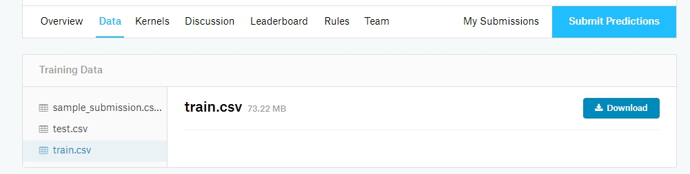
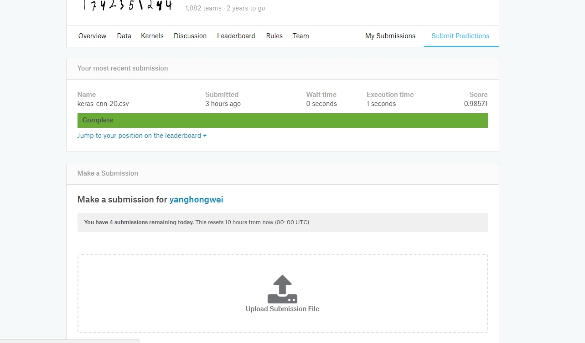
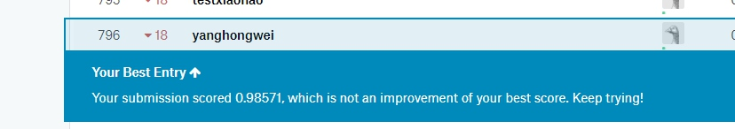

## 背景
本文将讲述通过keras写一个深度学习模型，来完成 kaggle 的 Digit Recognizer 准确率可达到98%。

## 下载数据
首先登入kaggle网站，点击competitions，在类型筛选中选择 Getting Started。然后点击Digit Recognizer。


下载Data中的train.csv（模型的训练数据）和test.csv（测试数据）。


## 使用keras训练卷积神经网络模型
下面的代码分为三部分：
1. 读取数据
2. 训练模型
3. 预测测试数据

```python
from __future__ import print_function
import keras
from keras.datasets import mnist
from keras.models import Sequential
from keras.layers import Conv2D, MaxPooling2D
from keras import backend as K
import pandas as pd
from keras.utils import np_utils
from keras.layers import Dense, Dropout, Activation, Flatten

batch_size = 128
num_classes = 10
epochs = 12

# Read data
train = pd.read_csv('input/train.csv')
y_train = train.ix[:,0].values.astype('int32')
x_train = (train.ix[:,1:].values).astype('float32')
x_test = (pd.read_csv('input/test.csv').values).astype('float32')

# input image dimensions
img_rows, img_cols = 28, 28

x_train = x_train.reshape(x_train.shape[0], img_rows, img_cols, 1)
x_test = x_test.reshape(x_test.shape[0], img_rows, img_cols, 1)
input_shape = (img_rows, img_cols, 1)

x_train /= 255
x_test /= 255
print('x_train shape:', x_train.shape)
print(x_train.shape[0], 'train samples')
print(x_test.shape[0], 'test samples')

# convert class vectors to binary class matrices
y_train = keras.utils.to_categorical(y_train, num_classes)
model = Sequential()
model.add(Conv2D(32, kernel_size=(3, 3),
                 activation='relu',
                 input_shape=input_shape))
model.add(Conv2D(64, (3, 3), activation='relu'))
model.add(MaxPooling2D(pool_size=(2, 2)))
model.add(Dropout(0.25))
model.add(Flatten())
model.add(Dense(128, activation='relu'))
model.add(Dropout(0.5))
model.add(Dense(num_classes, activation='softmax'))

model.compile(loss=keras.losses.categorical_crossentropy,
              optimizer=keras.optimizers.Adadelta(),
              metrics=['accuracy'])

model.fit(x_train, y_train,
          batch_size=batch_size,
          epochs=epochs,
          verbose=1)


print("Generating test predictions...")
preds = model.predict_classes(x_test, verbose=0)

def write_preds(preds, fname):
    pd.DataFrame({"ImageId": list(range(1,len(preds)+1)), "Label": preds}).to_csv(fname, index=False, header=True)

write_preds(preds, "keras-cnn.csv")
```

## 提交数据
将生成的keras-cnn.csv上传到kaggle中。


最终可以看到我们的准确率：


排名上中间左右



