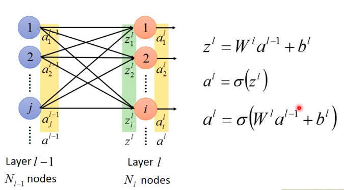
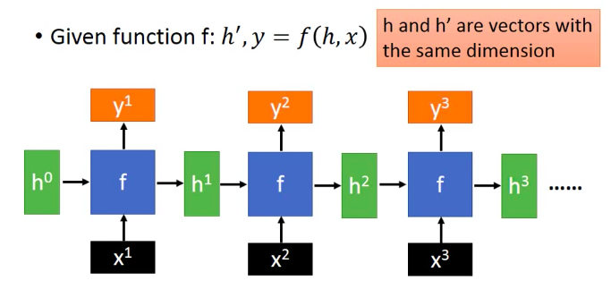
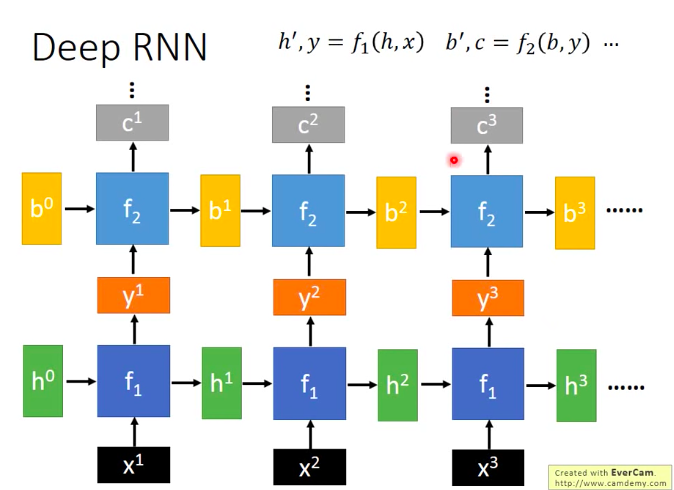
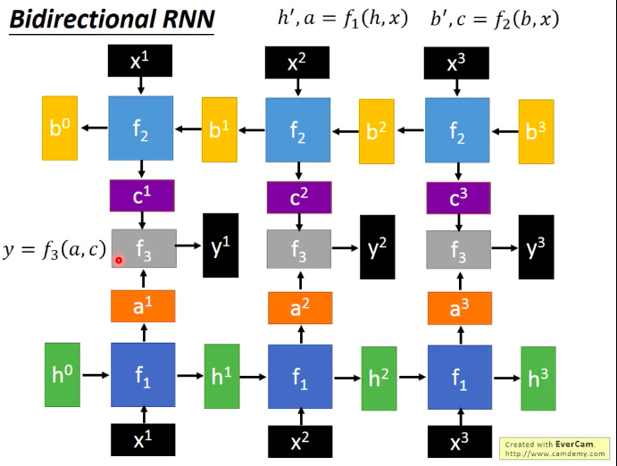
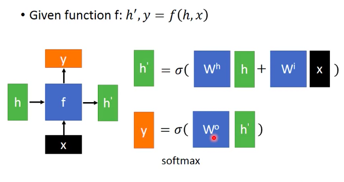
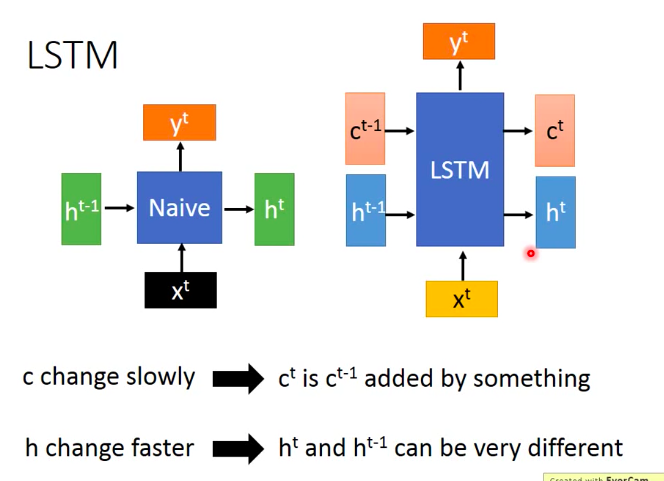
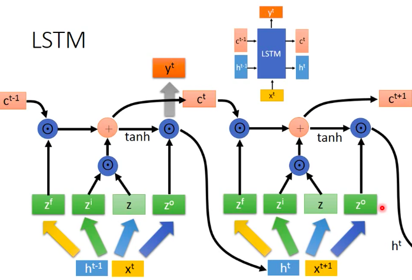
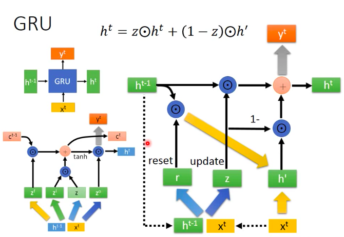

## 全连接神经网络

neroun的输出 用 $a_i^l$ 表示，l表示layer，i表示第i个neuron，同一层output用 vector $a^l$表示

两层网络之间的weit用$w_{ij}^l$表示l-1层的第i个neroun到l层的第j个neuron

$\sigma$ 表示激活函数

## 循环神经网络

### 基础网络架构
#### 	单层RNN

$x^1、h^0、y^1、h^1$都是vector

#### 多层RNN

#### 双向RNN

$f_1、f_2、f_3$没有强制规定可以自己设计

### Native RNN

### LSTM

c 的变化慢，可以记忆很久以前的数据

### GRU

---

[李宏毅](https://www.youtube.com/watch?v=IzHoNwlCGnE&list=PLqpH5_OnJdN4dIAEL3ih6ZGIrrbEh3xJL&index=2&t=2632s)

未完待续...