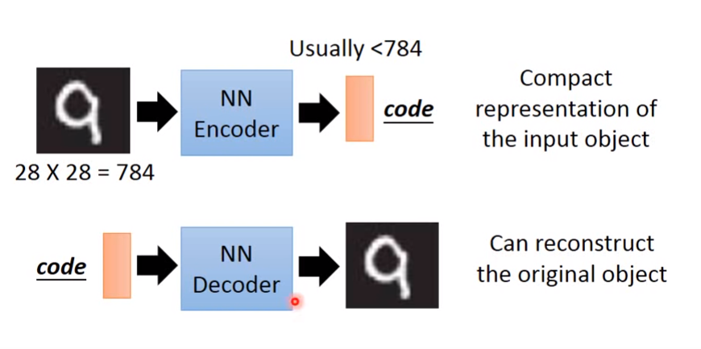
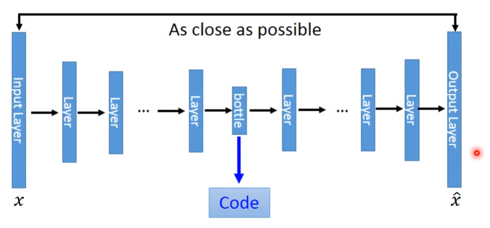
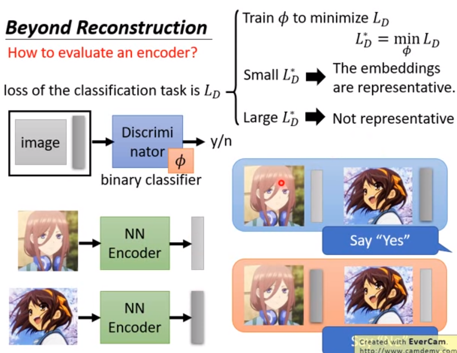

什么是auto-encoder ?

auto-encoder输入一个向量，目标是要让网络可以还原输入向量；从input layer 到bottle的过程叫encoder目的是给input降维，从bottle到output layer 的过程叫decoder目的是从input的低维向量表示还原回Input；bottle 是 compact（稠密，维度远低于input维度）的向量；

核心是思想是：如果低维的code 能够还原回input 那说明 code 能够很好的表示input向量（即稠密又没有丢失信息）；

decoder 的不同方式：
如下是一种让decoder （判断input 与 code 是否匹配）以二分类方式来评估 decoder 是否足够好

