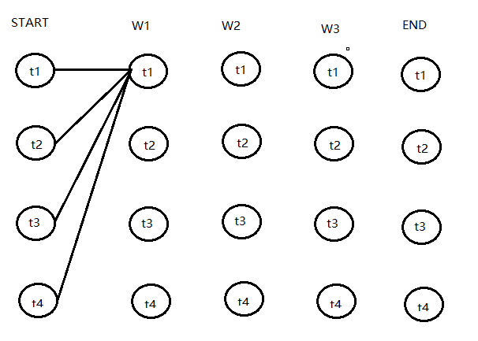

词性标注是比较基本的NLP任务，通常我们可以使用BI-LSTM CRF模型来完成；CRF在这里起的作用是能够约束标签序列使结果的合法性更好。例如，如果不使用CRF可能的结果是`B-LOC O E-LOC`

BLSTM这里就没什么说的了，我们这篇文章主要通过pytorch官网给的代码，讲解下CRF的实现部分。

我们定义两种概率矩阵，发射概率（emission ）和转移概率（transition）。$\text{EMIT}(y_i \rightarrow x_i)$表示 $x_i$映射到$y_i$的非归一化概率，$\text{TRANS}(y_{i-1} \rightarrow y_i)$表示 $y_{i-1}$转移到$y_{i}$的概率。
$$
P(y|x) = \frac{\exp{(\text{Score}(x, y)})}{\sum_{y'} \exp{(\text{Score}(x, y')})} \\

\text{Score}(x,y) = \sum_i \log \psi_i(x,y) \\

\text{Score}(x,y) = \sum_i \log \psi_\text{EMIT}(y_i \rightarrow x_i) + \log \psi_\text{TRANS}(y_{i-1} \rightarrow y_i)
$$

因而在训练中，我们只需要最大化似然概率$P(y|x)$即可，这里我们利用对数似然
$$
\log{P(y|x)} = \log{(\frac{\exp{(\text{Score}(x, y)})}{\sum_{y'} \exp{(\text{Score}(x, y')})})}  \\
= \text{Score}(x, y) - \log{(\sum_{y'} \exp{(\text{Score}(x, y')}))}
$$
所以我们将损失函数定义为$-\log{P(y|x)}$，就可以利用梯度下降法来进行网络的学习了。

在对损失函数进行计算的时候，$\text{Score}(x,y)$的计算很简单，而$\log{(\sum_{y'} \exp{(\text{Score}(x, y')}))}$（下面记作logsumexp）的计算稍微复杂一些，这里使用前向算法（forward algorithm）来进行计算。



如下代码中，feats 代表[W1, W2, W3]，next_tags代表[t1, t2, t3, t4]，当feat=W1，next_tag=t1时，feat里的值是[0.1, 0.2, 0.5, 0.3]，emit_score值为[0.1, 0.1, 0.1, 0.1]即在feat中取next_tag并extand到tag_size。transition 矩阵里的Entry i,j 是从j转移到i的值。所在 trans_score里的值是从t1-t4转移到t1的值。

```python
def _forward_alg(self, feats):
        init_alphas = torch.full((1, self.tagset_size), -10000.)
        init_alphas[0][self.tag_to_ix[START_TAG]] = 0.
        forward_var = init_alphas
        for feat in feats:
            alphas_t = []  
            for next_tag in range(self.tagset_size):
                emit_score = feat[next_tag].view(
                    1, -1).expand(1, self.tagset_size)
                trans_score = self.transitions[next_tag].view(1, -1)
                next_tag_var = forward_var + trans_score + emit_score
                alphas_t.append(log_sum_exp(next_tag_var).view(1))
            forward_var = torch.cat(alphas_t).view(1, -1)
        terminal_var = forward_var + self.transitions[self.tag_to_ix[STOP_TAG]]
        alpha = log_sum_exp(terminal_var)
        return alpha
```


**参考：**

[https://zhuanlan.zhihu.com/p/27338210](https://zhuanlan.zhihu.com/p/27338210)