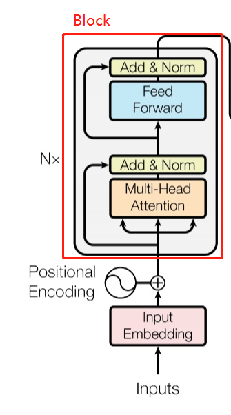

### 减少参数

1. 减少Embeding参数 ，用两层替代之前的一层，参数从原来的V * H 变成 V * E + E * H ， 这个E << H
2. 共享Block参数

​    这样做的好处是，将参数减少，进而增加模型的深度和宽度来提升模型效果，但同时带来了计算量的增加（大概3倍）

### 改进训练任务

通过实验表示，Next Sentence Predict 任务太过简单，使用 Reverce 的方式会更好；

### 去掉Dropout

Dropout实际的操作是防止过拟合，但对于无监督学习来说，训练语料是很多的不会有过拟合的问题，使用Dropout反而会增加内存的使用（会有一些缓存），去掉Dropout会有0.3的性能提升

### 增加训练数据

这个就没啥说的了

最重要的一点还是减少参数增加模型的深度和宽度带来的