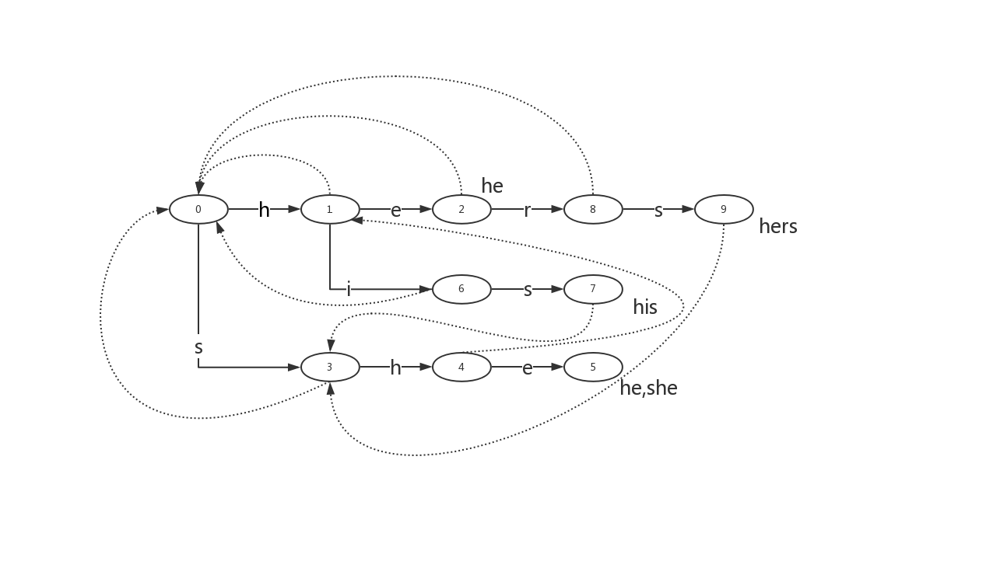

## 背景
在做实际工作中，最简单也最常用的一种自然语言处理方法就是关键词匹配，例如我们要对n条文本进行过滤，那本身是一个过滤词表的，通常进行过滤的代码如下
```java
for (String document : documents) {
    for (String filterWord : filterWords) {
        if (document.contains(filterWord)) {
            //process ...
        }
    }
}
```
如果文本的数量是n，过滤词的数量是k，那么复杂度为O(nk)；如果关键词的数量较多，那么支行效率是非常低的。
> 计算机科学中，Aho–Corasick算法是由Alfred V. Aho和Margaret J.Corasick 发明的字符串搜索算法，用于在输入的一串字符串中匹配有限组“字典”中的子串。它与普通字符串匹配的不同点在于同时与所有字典串进行匹配。算法均摊情况下具有近似于线性的时间复杂度，约为字符串的长度加所有匹配的数量。**然而由于需要找到所有匹配数，如果每个子串互相匹配（如字典为a，aa，aaa，aaaa，输入的字符串为aaaa），算法的时间复杂度会近似于匹配的二次函数。**

## 原理
在一般的情况下，针对一个文本进行关键词匹配，在匹配的过程中要与每个关键词一一进行计算。也就是说，每与一个关键词进行匹配，都要重新从文档的开始到结束进行扫描。AC自动机的思想是，在开始时先通过词表，对以下三种情况进行缓存：

1. 按照字符转移成功进行跳转（success表）
2. 按照字符转移失败进行跳转（fail表）
3. 匹配成功输出表（output表）

因此在匹配的过程中，无需从新从文档的开始进行匹配，而是通过缓存直接进行跳转，从而实现近似于线性的时间复杂度。

## 构建
构建的过程分三个步骤，分别对success表，fail表，output表进行构建。其中output表在构建sucess和fail表进行都进行了补充。fail表是一对一的，output表是一对多的。

### 按照字符转移成功进行跳转（success表）
sucess表实际就是一棵trie树，构建的方式和trie树是一样的，这里就不赘述。

### 按照字符转移失败进行跳转（fail表）
设这个节点上的字母为C，沿着他父亲的失败指针走，直到走到一个节点，他的儿子中也有字母为C的节点。然后把当前节点的失败指针指向那个字母也为C的儿子。如果一直走到了root都没找到，那就把失败指针指向root。 使用广度优先搜索BFS，层次遍历节点来处理，每一个节点的失败路径。

###  匹配成功输出表（output表）

## 匹配
举例说明，按顺序先后添加关键词he，she，,his，hers。在匹配ushers过程中。先构建三个表，如下图，实线是sucess表，虚线是fail表，结点后的单词是ourput表。





## 代码
`gist 2fed6f4569d4da8029e7ef08458cad6b`