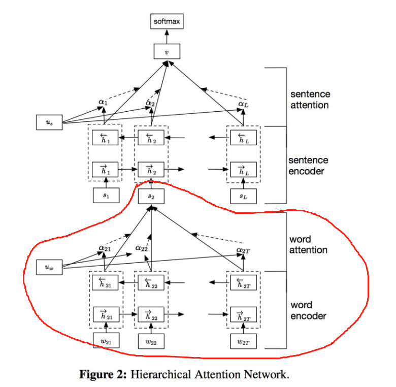

论文链接：[Hierarchical Attention Networks for Document Classification](https://link.zhihu.com/?target=https%3A//www.cs.cmu.edu/%7Ediyiy/docs/naacl16.pdf)

**HAN (Hierarchical Attention Networks for Document Classification)** 是一个针对文本分类任务的层次化 attention 模型。它有个显著的特点:通过"词-句子-文章"的层次化结构来表示一篇文本。

**HAN** 模型的灵感来源于人在阅读 document 的时候，不同的词和句子对人理解 document 信息有不同的影响。因为，词和句子的重要性是和上下文息息相关的，即使是相同的词和句子，在不同的上下文中重要性也不一样。人在阅读一篇文章时，对 document 不同的内容是有着不同的注意度的。

attention 的目的是要把一个句子中，对句子的含义影响最大的词语找出来。

论文通过将 $h_{it}$ 输入到一个 dense 网络中得到的结果$u_{it}$ 作为$h_{it}$的隐含表示。**$h_{it}$可以是双向RNN的结果，或者bert中经过encoder后的结果。**

$$
u_{it}=\tanh(W_wh_{it}+b_w)
$$

为了衡量单词的重要性，这里用$u_{it}$ 和一个随机初始化的上下文向量$u_w$  的相似度来表示，然后经过 softmax 操作获得了一个归一化的 attention 权重矩阵 $\alpha_{it}$，代表句子$i$中第 $t$个词的权重。

$$
\alpha_{it}=\frac{\exp(u^T_{it}u_w)}{\sum_t(\exp(u^T_{it}u_w))}
$$

得到了 attention 权重矩阵之后，句子向量 $s_i$ 可以看作这些词向量的加权求和。这里的上下文向量$u_w$ 是在训练网络的过程中学习获得的。我们可以把 $u_w$当作一种询问的高级表示，比如"哪些词含有比较重要的信息?

$$
s_i=\sum_t\alpha_{it}h_{it}
$$

使用这个句子向量就可以做句子level的任务，例如文本分类等。

---

主要查考：https://zhuanlan.zhihu.com/p/54165155

